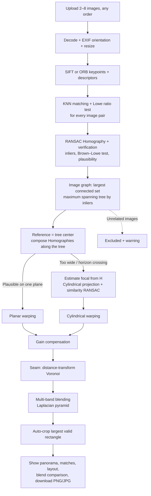

# Project Report Guide

## 1. Project title

**Automatic Panorama Stitcher: Multi-image Feature Matching, Homography Warping and Seamless Blending**

## 2. Problem statement

กล้องทั่วไปถ่ายภาพได้มุมรับภาพจำกัด ถ้าต้องการภาพทิวทัศน์หรืออาคารแบบมุมกว้าง ผู้ใช้ต้องถ่ายหลายภาพที่ซ้อนทับกันแล้วนำมาต่อ การต่อด้วยมือทำได้ยาก เพราะแต่ละภาพถ่ายจากมุมต่างกัน (ต้องปรับ perspective) แสงไม่เท่ากัน (auto-exposure, vignetting) และผู้ใช้อาจไม่ได้เรียงลำดับภาพ หรือมีภาพที่ไม่เกี่ยวข้องปนมา

โปรเจกต์นี้สร้างเว็บแอปที่รับภาพ 2–8 ภาพลำดับใดก็ได้ หาความสัมพันธ์ระหว่างภาพเองด้วย feature matching + RANSAC Homography จัดวางทุกภาพลงบนระนาบ (หรือทรงกระบอกเมื่อมุมกว้าง) แล้วรวมภาพให้ไร้รอยต่อด้วย exposure compensation และ multi-band blending

## 3. Objectives

1. ตรวจหา keypoints และสร้าง descriptors ด้วย SIFT (และ ORB เพื่อเปรียบเทียบ)
2. จับคู่ descriptor ด้วย KNN + Lowe's ratio test สำหรับ **ทุกคู่ภาพ**
3. ประมาณ Homography ด้วย RANSAC ตัด outliers และปฏิเสธคู่ภาพที่ไม่ได้ซ้อนทับกันจริง
4. หาลำดับและตำแหน่งของทุกภาพโดยอัตโนมัติ (image graph + maximum spanning tree) และตัดภาพที่ไม่เกี่ยวข้องออก
5. Warp ภาพลงระนาบอ้างอิง และเปลี่ยนเป็น cylindrical projection เมื่อมุมกว้างเกินระนาบเดียว
6. ปรับแสงระหว่างภาพ (gain compensation) และรวมภาพด้วย multi-band blending ให้ไม่เห็นรอยต่อ
7. ตัดขอบดำอัตโนมัติ แสดงหลักฐานของแต่ละขั้นตอนบน Streamlit และดาวน์โหลดผลลัพธ์ได้
8. ประเมินผลเชิงปริมาณเทียบกับโค้ดเวอร์ชันแรก ([EVALUATION.md](EVALUATION.md))

## 4. System architecture

## 5. Core methods

### 5.1 Feature extraction and matching

SIFT (ค่าเริ่มต้น) หา keypoints ที่ทนต่อการเปลี่ยนสเกลและการหมุน พร้อม descriptor 128 มิติ ORB ใช้ FAST + BRIEF แบบ binary (เร็วกว่าแต่ตำแหน่งจุดแม่นน้อยกว่า) สำหรับแต่ละ descriptor ในภาพ $A$ หาเพื่อนบ้านใกล้ที่สุด 2 ตัวในภาพ $B$ ($d_1 \le d_2$) และเก็บคู่นั้นเมื่อ

$$
\frac{d_1}{d_2} < \tau, \qquad \tau = 0.75 \;(\text{ปรับได้})
$$

จากนั้นถ้าหลายจุดในภาพ $A$ ชี้มาที่จุดเดียวกันในภาพ $B$ จะเก็บเฉพาะคู่ที่ descriptor ใกล้ที่สุด ระบบจับคู่ **ทุกคู่ภาพ** จึงไม่ต้องให้ผู้ใช้เรียงลำดับ

### 5.2 Homography and RANSAC

Homography แปลงจุดบนภาพหนึ่งไปยังอีกภาพ เมื่อฉากเป็นระนาบหรือกล้องหมุนรอบจุดเดิม:

$$
s\begin{bmatrix}x' \\ y' \\ 1\end{bmatrix} =
\mathbf{H}\begin{bmatrix}x \\ y \\ 1\end{bmatrix},
\qquad \mathbf{H}\in\mathbb{R}^{3\times3},\; 8 \text{ DOF}
$$

RANSAC สุ่ม 4 คู่จุด แก้ $\mathbf{H}$ ด้วย DLT นับ inliers ที่ reprojection error $\lVert \mathbf{x}' - \pi(\mathbf{H}\mathbf{x}) \rVert <$ threshold (ค่าเริ่มต้น 4 px) ทำซ้ำจนได้ความมั่นใจ $p = 0.995$ ต้องใช้จำนวนรอบประมาณ $N = \log(1-p) / \log(1-w^4)$ เมื่อ $w$ คือสัดส่วน inliers แล้วปรับ $\mathbf{H}$ ด้วย Levenberg–Marquardt บน inliers ทั้งหมด (`cv2.findHomography`)

คู่ภาพจะถูกใช้เมื่อผ่านทุกข้อ:

- inliers ≥ 15 และ inliers > 8 + 0.3 × จำนวน good matches (เกณฑ์ของ Brown & Lowe, 2007) กันคู่ภาพที่ไม่ได้ซ้อนทับกันจริง ยกเว้นคู่ที่มี inliers ≥ 100 ซึ่งเกิดจากความบังเอิญไม่ได้ (ภาพจริงที่มีคน/วัตถุใกล้กล้องมี outliers เยอะแม้ภาพซ้อนกันจริง เช่นชุด class)
- เมทริกซ์มีค่า finite, มุมภาพไม่ถูกฉายเลยเส้นขอบฟ้า ($w > 0$), ไม่กลับด้าน/พับ (สี่เหลี่ยมนูนทิศเดิม), พื้นที่เปลี่ยนไม่เกิน 8 เท่า และความลึกของมุมภาพต่างกันไม่เกิน 6 เท่า

### 5.3 Image graph, reference image and multi-image composition

แต่ละภาพคือ node และคู่ที่ผ่านการตรวจคือ edge ที่มีน้ำหนักเท่ากับจำนวน inliers ระบบทำงานดังนี้:

1. เลือกกลุ่มภาพที่เชื่อมกันได้ใหญ่ที่สุด ภาพนอกกลุ่มถูกตัดออกพร้อมแจ้งเตือน
2. สร้าง maximum spanning tree (Kruskal) ให้ทุกภาพเชื่อมกันผ่านคู่ที่แม่นที่สุด
3. เลือกภาพอ้างอิงเป็น tree center (eccentricity ต่ำสุด) ภาพริมจึงถูกยืดน้อยที่สุด
4. หา transform ของภาพ $k$ ไปภาพอ้างอิงโดยคูณ Homography ตามเส้นทางในต้นไม้ $\mathbf{H}_{k\to r} = \mathbf{H}_{p\to r}\,\mathbf{H}_{k\to p}$
5. เรียงลำดับซ้าย→ขวาจากตำแหน่งบน canvas (ใช้แสดงผล)

### 5.4 Planar vs cylindrical projection

ถ้า transform ที่คูณต่อกันทำให้ภาพใดข้ามเส้นขอบฟ้าหรือยืดผิดปกติ (เช่นกล้องหมุนรวมเกิน ~120°) โหมด Auto จะเปลี่ยนเป็น cylindrical projection:

- ประมาณ focal length $f$ จาก Homography ของกล้องที่หมุนรอบจุดเดิม $\mathbf{H} = \mathbf{K}\mathbf{R}\mathbf{K}^{-1}$: เลือก $f$ เดียวที่ทำให้ $\mathbf{M} = \mathbf{K}^{-1}\mathbf{H}\mathbf{K}$ (หารสเกลออก) ใกล้เมทริกซ์การหมุนที่สุด คือ $\lVert \mathbf{M}\mathbf{M}^\top - \mathbf{I} \rVert$ เฉลี่ยทุกคู่ภาพต่ำสุด ค่าผู้สมัครมาจากสูตรของ Szeliski & Shum (1997) และค่าที่ไล่ละเอียด 0.3–5 เท่าของด้านยาวภาพ (สูตรอย่างเดียวไม่เสถียรเมื่อกล้องหมุนแนวนอนล้วน ๆ ซึ่งพบจริงในชุด city) ถ้าไม่มี $f$ ไหนอธิบายได้ (ไม่ใช่กล้องหมุน) จะใช้ค่าเริ่มต้นพร้อมแจ้งเตือน
- ฉายภาพลงทรงกระบอก: $\theta = \arctan(x/f)$, $h = y/\sqrt{x^2+f^2}$, $(u, v) = (f\theta + c_x,\; f h + c_y)$
- แปลงพิกัด keypoints ตามสูตรเดียวกัน (ไม่ต้องหา feature ใหม่) แล้วใช้ RANSAC หา similarity transform (4 DOF) บนพิกัดทรงกระบอก

### 5.5 Warping

หาขอบเขต canvas จากมุมของทุกภาพหลังแปลง เลื่อนให้พิกัดเป็นบวก แล้ว `warpPerspective` แต่ละภาพลงเฉพาะกรอบ (ROI) ที่ภาพครอบคลุมเพื่อประหยัดหน่วยความจำ ถ้า canvas เกิน 12 MP จะย่อผลลัพธ์ลงแทนการ error

### 5.6 Exposure (gain) compensation

หา gain $g_i$ ต่อช่องสีของแต่ละภาพจาก least squares (Brown & Lowe, 2007):

$$
e = \sum_{i}\sum_{j \ne i} N_{ij}\left[\frac{(g_i \bar I_{ij} - g_j \bar I_{ji})^2}{\sigma_N^2} + \frac{(1-g_i)^2}{\sigma_g^2}\right]
$$

$N_{ij}$ คือจำนวนพิกเซลที่ซ้อนกัน และ $\bar I_{ij}$ คือสีเฉลี่ยของภาพ $i$ ในส่วนที่ซ้อนกับภาพ $j$ ใช้ $\sigma_N = 10$ และ $\sigma_g = 0.3$ (หลวมกว่า 0.1 ในบทความ เพราะมือถือปรับแสงต่างกันได้เกิน 10%) แล้ว normalize ให้ gain เฉลี่ยเป็น 1

### 5.7 Seam and multi-band blending

- **Seam:** แต่ละพิกเซลเป็นของภาพที่พิกเซลนั้นอยู่ลึกจากขอบภาพมากที่สุด (distance transform) seam จึงอยู่กลางส่วนซ้อนทับ
- **Multi-band blending (Burt & Adelson, 1983):** สร้าง Laplacian pyramid ของแต่ละภาพ $L^i_k = G^i_k - \mathrm{expand}(G^i_{k+1})$ และ Gaussian pyramid ของ seam mask $W^i_k$ แล้วรวมทีละชั้น

$$
L_k = \frac{\sum_i W^i_k L^i_k}{\sum_i W^i_k}, \qquad
\text{panorama} = L_0 + \mathrm{expand}(L_1 + \mathrm{expand}(L_2 + \dots))
$$

  รายละเอียดความถี่สูงถูกผสมในช่วงแคบ (ภาพคม ไม่มีเงาซ้อน) ส่วนความถี่ต่ำ (แสง/สี) ถูกผสมในช่วงกว้าง รอยต่อจึงกลืนกัน ก่อนสร้าง pyramid ระบบเติมสีจากขอบภาพออกไปในบริเวณที่ไม่มีข้อมูล (push–pull) และขยาย seam label ไปถึงขอบ canvas เพื่อไม่ให้ขอบพาโนรามามืด
- **Feather** (distance-weighted average) และ **วางทับ** (แบบเวอร์ชันแรก) ยังเลือกได้ เพื่อใช้เปรียบเทียบ

### 5.8 Auto-crop

หาสี่เหลี่ยมที่ใหญ่ที่สุดที่อยู่ในบริเวณที่มีข้อมูลทั้งหมด (maximal rectangle ด้วย histogram + stack บน mask ที่ย่อขนาด) แล้วตรวจซ้ำที่ความละเอียดเต็มว่าไม่มีพิกเซลดำเหลืออยู่

## 6. Evaluation

ผลเต็มอยู่ที่ [EVALUATION.md](EVALUATION.md) ประกอบด้วยภาพสังเคราะห์ที่รู้ ground truth 70 ชุด, กล้องหมุนมุมกว้าง 5 ชุด และภาพจริงจากอินเทอร์เน็ต 5 ชุดใน `test_images/` รันซ้ำได้ด้วย `python scripts/evaluate.py` และ `python scripts/evaluate.py --real test_images`

ภาพจริงไม่มี ground truth จึงรายงานเป็นตัวเลขความสอดคล้อง (จำนวนภาพที่ต่อได้, inliers, inlier ratio, reprojection RMSE, projection, focal) ร่วมกับการตรวจด้วยตาว่ามีรอยต่อ/เงาซ้อน/เส้นตรงหักหรือไม่ แยกจากผลบนภาพสังเคราะห์

### 6.1 ชุดภาพทดสอบจากอินเทอร์เน็ตและ edge case สำหรับ live demo

กลุ่มตกลงใช้ **ภาพจากอินเทอร์เน็ต** แทนการถ่ายเอง โดยเก็บไว้ใน `test_images/` เป็นชุดพาโนรามา 5 ชุด และชุด edge case `textureless` 1 ชุด ภาพแต่ละชุดถ่ายจากจุดเดียวกันด้วยกล้องตัวเดียว เว็บดึงชุดเหล่านี้มาเป็นตัวเลือก “ใช้ชุดภาพตัวอย่าง” ได้ทันที หรือจะดาวน์โหลดไฟล์แล้วอัปโหลดผ่านปุ่มอัปโหลดตอนเดโมก็ได้

ผลในคอลัมน์ขวาสุดคือผลที่ได้จริงเมื่อทดสอบกับเว็บเวอร์ชันปัจจุบัน

| รหัส | ภาพที่ใช้ | วิธีทำบนเว็บ | ผลที่ได้ (ทดสอบแล้ว) |
|---|---|---|---|
| E1 ปกติ | `house` หรือ `building` (5 ภาพ) | เลือกชุดแล้วกดสร้าง | ต่อครบ 5/5, Planar, ไม่เห็นรอยต่อ |
| E2 สลับลำดับ | `building` | เปิด “สลับลำดับภาพ” (หรืออัปโหลดโดยลากไฟล์ทีละไฟล์สลับกัน) | ข้อความ “ลำดับจากซ้ายไปขวา” เรียง building1 → 5 ถูกต้อง |
| E3 ภาพแปลกปลอม | `building` + ภาพ 1 ภาพจาก `cafe` | เปิด “เพิ่มภาพแปลกปลอม” (หรืออัปโหลด building 5 ภาพ + ภาพจากชุดอื่น) | ต่อได้ 5/6 + คำเตือนว่าภาพแปลกปลอมไม่ถูกนำมาต่อ |
| E4 ซ้อนกันน้อย | `building2.jpg` + `building4.jpg` และ `building1.jpg` + `building4.jpg` | อัปโหลดทีละคู่ | คู่แรกซ้อนกันน้อยแต่ยังต่อได้ (inliers 70/128) คู่ที่สองขึ้น error พร้อมเหตุผล (inliers 5 < 15) |
| E5 ไม่มี feature | `textureless` (`wall.jpg` ผนังขาว + `sky.jpg` ท้องฟ้า/ทะเล) | เลือกชุดแล้วกดสร้าง | ไม่ crash, ขึ้น error “คู่จุดน้อยเกินไป” พร้อมตารางคู่ภาพ; ภาพท้องฟ้ามี SIFT keypoints แค่ 4 จุด (ดูได้ในตารางคู่ภาพ) |
| E6 แสงต่างกัน | `cafe` (ในร่ม/กลางแจ้ง gain ต่างกันถึง 1.26 เท่า) | ปิด Exposure compensation → สร้าง → เปิดกลับ → สร้างใหม่ | ตาราง gain ในแท็บข้อมูลทางเทคนิค + แท็บเปรียบเทียบ Blending |
| E7 มุมกว้าง | `city` (8 ภาพ หมุนรวม ~140°) | กดสร้างด้วย Projection อัตโนมัติ แล้วลองตั้งเป็น Planar | Auto → Cylindrical ต่อครบ 8/8 (focal ≈ 985 px); บังคับ Planar → error อธิบายว่าภาพถูกยืดเกิน |
| E8 Parallax / คนใกล้กล้อง | `class` (คนอยู่ใกล้กล้องในภาพแรก), `cafe` (โต๊ะ/แก้วใกล้กล้อง) | กดสร้างแล้วดูตารางคู่ภาพ | ต่อครบ แต่ inlier ratio ต่ำ (~45–60%) และวัตถุใกล้กล้องอาจบิด/ขาดที่ seam ใช้อธิบายข้อจำกัดของ homography |

ใช้ชุดเหล่านี้กับการตั้งค่าขั้นสูงด้วย เช่น สลับ SIFT/ORB บน `house` หรือปรับ Lowe's ratio 0.6 กับ 0.9 แล้วดูจำนวน good matches และเส้นสีแดงเปลี่ยน

## 7. Failure handling

- ภาพที่อ่านไม่ได้ → แจ้งชื่อไฟล์และข้ามไป ภาพที่อ่านได้ยังใช้ต่อ
- ภาพไม่มี feature (เช่นผนังเรียบ) → ไม่ crash ได้ 0 matches และแจ้งผลในตารางคู่ภาพ
- คู่ภาพที่ไม่ซ้อนทับ → RANSAC verification ปฏิเสธ พร้อมเหตุผลในตาราง
- ภาพที่ไม่เกี่ยวข้อง → ถูกตัดออกจากโครงข่ายพร้อมคำเตือน ส่วนภาพอื่นยังต่อได้
- ไม่มีคู่ภาพใดใช้ได้ → แสดงข้อความ error ที่บอกคู่ที่ใกล้เคียงที่สุดและคำแนะนำการถ่ายภาพ พร้อมตารางผลการจับคู่
- มุมกว้างเกินระนาบเดียว → Auto เปลี่ยนเป็น cylindrical แต่ถ้าบังคับ Planar จะแจ้ง error แทนการสร้างภาพที่บิด
- focal ประมาณไม่ได้ → ใช้ค่าเริ่มต้นและแจ้งเตือน หรือให้ผู้ใช้กรอกเอง
- พาโนรามาใหญ่เกินหน่วยความจำ → ย่อผลลัพธ์ลงพร้อมแจ้งเปอร์เซ็นต์
- Auto-crop ตัดพื้นที่ทิ้งเกินครึ่ง → แจ้งให้ปิด auto-crop เพื่อดูภาพเต็ม

## 8. Suggested five-person responsibility split

| Member | Primary responsibility | Presentation section |
|---|---|---|
| 1 | Requirements and test-image collection | Problem and objectives |
| 2 | SIFT/ORB, descriptors, KNN and ratio test | Keypoints and matching |
| 3 | RANSAC, homography verification and image graph | Geometry and multi-image alignment |
| 4 | Warping, exposure compensation and multi-band blending | Warping and blending |
| 5 | Streamlit UI, deployment, testing and evaluation | Demo and conclusion |

## 9. Limitations and future work

- ภาพจริงมีชุดพาโนรามา 5 ชุด (28 ภาพ) และไม่มี ground truth จึงวัดความแม่นยำเป็นพิกเซลได้เฉพาะบนภาพสังเคราะห์
- ฉากที่มี parallax (วัตถุใกล้กล้อง, เดินขยับระหว่างถ่าย) ทำให้ homography ไม่พอดีทั้งภาพ แก้ได้ด้วย seam finding แบบ graph-cut หรือ local warping (APAP)
- วัตถุเคลื่อนที่อาจเกิดเงาซ้อน (ghosting) → ใช้ seam ที่หลบบริเวณที่ภาพต่างกันมาก
- ยังไม่มี bundle adjustment: ทดลอง refinement ของ homography 8 DOF ทุกภาพพร้อมกันแล้วไม่ช่วย (ดู EVALUATION.md) ขั้นต่อไปคือ bundle adjustment ของการหมุนกล้อง + focal (≈4 DOF ต่อภาพ) แบบ Brown & Lowe
- Cylindrical projection รองรับการหมุนแนวนอนเป็นหลัก ยังไม่รองรับพาโนรามา 360° ที่ต่อปิดวง หรือหลายแถว (spherical)
- ยังไม่มี wave correction และการแก้ lens distortion
- รองรับสูงสุด 8 ภาพต่อครั้ง และย่อภาพเหลือด้านยาว 1,200 px โดยค่าเริ่มต้นเพื่อให้ทำงานบน Streamlit Community Cloud ได้

## 10. References

- M. Brown and D. G. Lowe, “Automatic Panoramic Image Stitching using Invariant Features,” *IJCV*, 74(1), 2007.
- D. G. Lowe, “Distinctive Image Features from Scale-Invariant Keypoints,” *IJCV*, 60(2), 2004.
- E. Rublee et al., “ORB: An efficient alternative to SIFT or SURF,” *ICCV*, 2011.
- M. A. Fischler and R. C. Bolles, “Random Sample Consensus,” *Communications of the ACM*, 24(6), 1981.
- P. J. Burt and E. H. Adelson, “A Multiresolution Spline with Application to Image Mosaics,” *ACM Transactions on Graphics*, 2(4), 1983.
- R. Szeliski and H.-Y. Shum, “Creating Full View Panoramic Image Mosaics and Environment Maps,” *SIGGRAPH*, 1997.
- R. Szeliski, “Image Alignment and Stitching: A Tutorial,” *Foundations and Trends in Computer Graphics and Vision*, 2(1), 2006.
- R. Hartley and A. Zisserman, *Multiple View Geometry in Computer Vision*, 2nd ed., Cambridge University Press, 2004.
